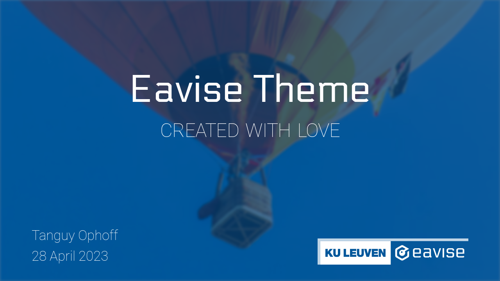
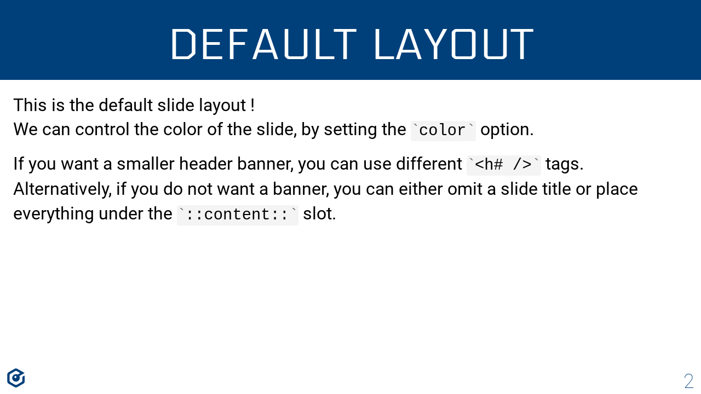

<br/>
<p align="center">

</p>

<p align="center">
A <a href="https://sli.dev">Slidev</a> theme for the <a href="https://www.eavise.be">EAVISE</a> research group.
</p>

<p align="center">
<a href="https://www.npmjs.com/package/slidev-theme-eavise"></a>
<a href="https://0phoff.github.io/slidev-theme-eavise"></a>
</p>

## Install

Add the following frontmatter to your `slides.md`.  
Start Slidev, which will then prompt you to install the theme automatically.

```yaml
---
theme: eavise
---
```

Alternatively, you can install the `slidev-theme-eavise` package manually, if you need a specific version.  
Learn more about [how to use a theme](https://sli.dev/themes/use).

## Layouts

### cover


The cover slide page for starting your presentations.

If the first two elements are `<h# />` tags, they get placed in the center of the screen.
This can be used to set a title and subtitle.

| Property        | Default                     | Description |
|:---------------:|:---------------------------:|:------------|
| author          | undefined                   | Author name. |
| date            | Today's date (DD MMM YYYY)  | Date. |
| image           | undefined                   | Background image (can be url or local file). |
| image-filter    | undefined                   | [CSS filter](https://developer.mozilla.org/en-US/docs/Web/CSS/filter) which is applied to the image only. |
| image-transform | undefined                   | [CSS transform](https://developer.mozilla.org/en-US/docs/Web/CSS/transform) which is applied to the image only. |
| color           | var(--slidev-theme-primary) | Color applied on top of the image. Note that it is applied as a CSS `background` and thus can also contain eg. gradients. |
| color-opacity   | 0.75                        | Opacity of the color layer (only used if there is an image). |
| text-color      | image ? 'white' : 'inherit' | Text color (also changes logo color). |

### default


The default slide layout with a header and footer.

If the first element of the slide is an `<h# />`, it will be placed in the header.  
Additionally, you can place your content in the `::content::` slot, which will take all the remaining space after the title.
This allows you to eg. center content on the page.  
Finally, the `::content::` slot also allows you to use an `<h# />` element without it becoming a preconfigured header block.

| Property      | Default                     | Description |
|:-------------:|:---------------------------:|:------------|
| color         | var(--slidev-theme-primary) | Base color for header and footer. |

### image


A slide with a fullscreen image.

The content in this slide is not positioned.  
We recommend using a `<style />` tag where you can position the content by eg. adding a grid/flexbox to your `.slidev-layout`.

| Property        | Default                     | Description |
|:---------------:|:---------------------------:|:------------|
| image           | undefined                   | Background image (can be url or local file). |
| image-filter    | undefined                   | [CSS filter](https://developer.mozilla.org/en-US/docs/Web/CSS/filter) which is applied to the image only. |
| image-transform | undefined                   | [CSS transform](https://developer.mozilla.org/en-US/docs/Web/CSS/transform) which is applied to the image only. |
| color           | undefined                   | Color applied on top of the image. Note that it is applied as a CSS `background` and thus can also contain eg. gradients. |
| color-opacity   | 0.75                        | Opacity of the color layer (only used if there is an image). |
| text-color      | image ? 'white' : 'inherit' | Text color (sets --text-color var, which can be used by other content as well). |

### section


A slide to separate sections.

This is a simple image layout, with special positioning for the first element (if it is a `<h# />` tag).  
This allows you to easily create an image slide with a short title.

Note that if you do not pass a `number`, the slide title will be centered.
If there is a slide number, the layout slightly changes as shown in the screenshot above.

| Property        | Default                     | Description |
|:---------------:|:---------------------------:|:------------|
| number          | undefined                   | Section number. |
| image           | undefined                   | Background image (can be url or local file). |
| image-filter    | undefined                   | [CSS filter](https://developer.mozilla.org/en-US/docs/Web/CSS/filter) which is applied to the image only. |
| image-transform | undefined                   | [CSS transform](https://developer.mozilla.org/en-US/docs/Web/CSS/transform) which is applied to the image only. |
| color           | undefined                   | Color applied on top of the image. Note that it is applied as a CSS `background` and thus can also contain eg. gradients. |
| color-opacity   | 0.75                        | Opacity of the color layer (only used if there is an image). |
| text-color      | image ? 'white' : 'inherit' | Text color. |


## Components

### IconEavise
The EAVISE icon as an inline SVG.

### LogoEavise
The EAVISE logo as an inline SVG.

### LogoEaviseKUL
The EAVISE + KU Leuven logo as an inline SVG.

## Contributing

- `pnpm install`
- `pnpm run dev` to start theme preview of `example.md`
- Edit the `example.md` and style to see the changes
- `pnpm run export` to generate the preview PDF
- `pnpm run screenshot` to generate the preview PNG

## License

<p align="center">
MIT License © 2023 <a href="https://github.com/0phoff">0phoff</a>
</p>

<p align="center">

</p>
